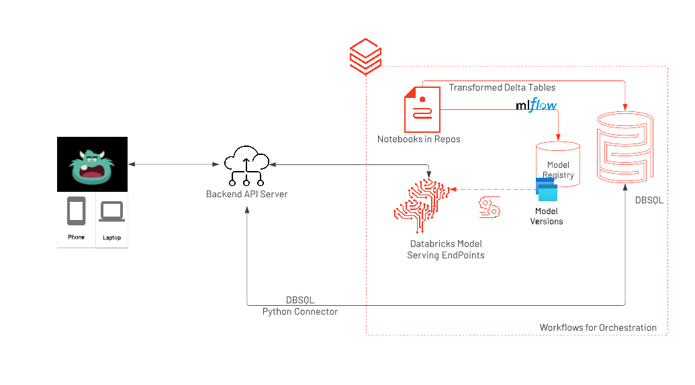

# Lakehmon -- The Monster in the Lakehouse
The repo shows how you can build cross platform applications with [Flutter](flutter.dev) , [fastAPI](https://fastapi.tiangolo.com/) and the Databricks APIs. Specifically, we use Databricks Serverless Serving capability to demonstrate the features of this web/desktop application. 

The web applications requires the intermediary - i.e. FASTAPI service to collect and send requests out to databricks while the desktop application does not. You can choose to try out the application in either way or both. 

[Click here for a Quick Cross-Platform Demo](https://www.youtube.com/watch?v=kYHJo_7FRcU)

For reference,here's the complete architecture which assumes that you'd need the backend service

Architecture:


To reproduce demo:
1. Install Flutter locally
    -  On [Mac](https://docs.flutter.dev/get-started/install/macos#system-requirements). Go through the install guide until `flutter doctor` to ensure flutter is set up properly.
2. Clone repo to your machine
3. From the terminal `flutter run -d chrome`
4. Make sure the [backend service](https://github.com/sathishgang-db/lakehmon-backend) is running. If not, close the [repo](https://github.com/sathishgang-db/lakehmon-backend) & follow the steps on the repo's readme.
5. Enjoy the demo!

----
```Note:```
This demo uses the following datasets from kaggle to pull recommendations

a. Halloween Costume recommendations based on [this dataset](https://www.kaggle.com/datasets/thomaskonstantin/popular-halloween-costumes-amazon-reviews) on kaggle.

b. Horror movie recommendations based on [this dataset](https://www.kaggle.com/datasets/PromptCloudHQ/imdb-horror-movie-dataset) on kaggle.

------

**To build and deploy:**
This is an <i>optional</i> step for anyone interested in deploying the app. Since the app uses heavy animations & elaborate state management, it's best to deploy it on a separate VM following the standard flutter web deploy recommendations. 

1. Build the release package: Run `flutter build web` on the terminal. This will generate the js and the files needed to host the app on your server.
2. Move files on the `build/web` folder to your server
3. Run `dhttpd` or a set up a web server from this folder on your server. See [here in the official flutter docs](https://docs.flutter.dev/deployment/web#building-the-app-for-release).
